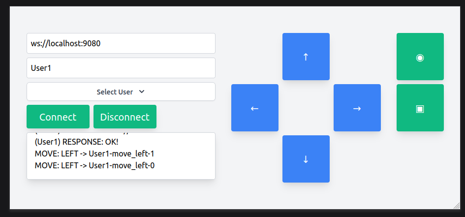

# About

A joystick service that sends commands to a websocket, written in go.



## Usage

```bash
$ go run cmd/joystick-server/server.go
connecting to localhost:8080
```

in another terminal

```bash
$ go run cmd/joystick-client/client.go
connecting to localhost:8081
```

Go to the client in the browser and move the joystick around. The server will receive the commands and print them to the console.

Check the available flags for the server and client:

```bash
go run cmd/joystick-client/client.go -help
Usage of /tmp/go-build2401914539/b001/exe/client:
  -clientAddr string
        http client address. Must include the port. Does not include the protocol (http://) (default "localhost:8081")
  -clientName string
        Name of the user client. Used to identify the client to the server
  -serverAddr string
        websocket or http service address. Must include the protocol (ws:// or http://) and the port number (default "ws://localhost:8080")
  -serverEndpoint string
        Endpoint at the server to connect to where messages will be sent (default "/echo")
```

and for the toy server:

```bash
$ go run cmd/joystick-server/server.go -help
Usage of /tmp/go-build1929449632/b001/exe/server:
  -serverAddr string
        HTTP service address where the server will be listening from. Does not include the protocol (http://) (default "localhost:8080")
```

For example, to connect to the echo server in the server.go file, run the following command:

```bash
$ go run cmd/joystick-client/client.go  -serverAddr ws://localhost:8080 -serverEndpoint /echo -clientAddr localhost:8081 -clientName "test-client"
```

## Developing with [air](https://github.com/air-verse/air?tab=readme-ov-file)

Air allows, among other things, to live reload applications during development. In separate terminals run the following commands:

```bash
$ air -c .air.joystick-client.toml # runs the client in port 8091
```

```bash
$ air -c .air.joystick-server.toml # runs the server in port 8090
```

To connect to the sompics server, run the following command:

```bash
$ air -c .air.joystick-client-sompics.toml # runs the server in port 8091, and connects to sompics in port 9080
```

## License

MIT

## Credits

- Robots lovingly delivered by [Robohash](https://robohash.org/)